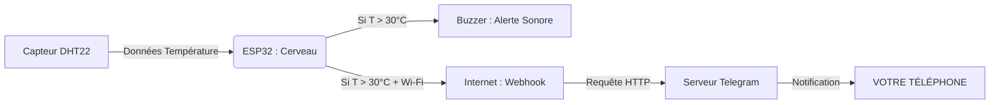

# 🎓 Cours : Comprendre le Projet "BuzzerTemp"

Ce document explique le fonctionnement du système pour un contexte d'apprentissage (TP ou Projet Étudiant).

## 1. L'Objectif
Nous voulons créer un objet connecté (**IoT**) capable de surveiller l'environnement et de réagir de deux façons :
1.  **Réaction Locale** : Immédiate (Le Buzzer sonne). Pour prévenir les gens dans la pièce.
2.  **Réaction Distante** : Connectée (Notification sur téléphone). Pour prévenir le superviseur absent.

## 2. Le Schéma Logique (Architecture)

## 3. Concepts Clés du Code

### A. La Boucle de Lecture (Polling)
L'ESP32 ne "sait" pas quand la température change. Il doit demander au capteur régulièrement.
*   **Problème** : Si on demande trop souvent (ex: 100 fois par seconde), on chauffe le processeur et on sature le capteur.
*   **Solution** : On lit toutes les **2 secondes** (`READ_INTERVAL`).
*   **Astuce Code** : On n'utilise pas `delay(2000)` qui bloquerait tout (le processeur ne pourrait rien faire d'autre). On utilise `millis()` (le chronomètre interne) pour vérifier si 2 secondes sont passées.

### B. L'Hystérésis (La Stabilité)
Imaginez que la température soit exactement à la limite : `29.9°C` -> `30.0°C` -> `29.9°C` -> `30.1°C`.
Sans hystérésis, le buzzer ferait *Bip... Silence... Bip... Silence* très vite. C'est agaçant et mauvais pour le matériel.

**Solution** : L'Hystérésis.
*   On **ALLUME** l'alerte à **30°C** (`TEMP_THRESHOLD`).
*   On **ÉTEINT** l'alerte seulement si ça redescend à **29°C** (`TEMP_THRESHOLD - TEMP_HYSTERESIS`).
Cela crée une zone de stabilité.

### C. L'Anti-Spam (Cooldown)
Si la température reste à 35°C pendant 1 heure :
*   Le Buzzer doit sonner en continu (c'est une urgence locale).
*   MAIS on ne veut pas recevoir 1000 notifications Telegram (1 toutes les 2 secondes).

**Solution** : Le `NOTIF_COOLDOWN`.
On note l'heure de la dernière notification (`lastNotifTime`). On n'en renvoie pas de nouvelle tant que 60 secondes ne sont pas écoulées.

### D. Le Webhook (L'API)
Comment l'ESP32 envoie un message ? Il se comporte comme un navigateur web.
Quand vous tapez une URL dans Chrome, vous envoyez une requête **GET**.
L'ESP32 fait exactement la même chose avec la bibliothèque `HTTPClient`. Il "ouvre" l'URL de CallMeBot, ce qui déclenche l'envoi du message chez eux.

## 4. Pour aller plus loin (Questions d'examen ?)
1.  *Que se passe-t-il si le Wi-Fi coupe ?* -> Le code est prévu pour continuer à faire sonner le Buzzer (sécurité locale), mais il affichera une erreur pour la notification.
2.  *Pourquoi un Buzzer "Actif" ?* -> Car il suffit de lui donner du courant (HIGH) pour qu'il sonne. Un buzzer passif aurait besoin qu'on lui envoie une fréquence (des ondes) pour faire du bruit.
